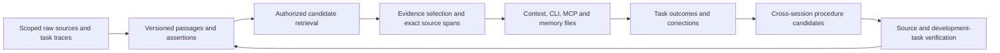

# Sibyl 1.4: Dream It

### Evidence checkpoint (September 15, 0:44 UTC, initial native counts accepted)

The initial native count run is complete and accepted. All 40 retained proposal requests cover the original 233 admitted sources and 240 assignment slots. Every count returned and qualified exactly once, totaling 10,018,350 input tokens. The original capture, completed summary and historical ledger remain intact. Counting produced no consolidated memory, generation reservation or solver result.

The measured initial proposal reservation is $88.073815. Existing holds remain $217.247410, including both unknown-usage attempts. Together, the $305.321225 initial-only floor exceeds the current $300 memory ceiling by $5.321225, before critics, corrections, embeddings or retries. Reservations are conservative bounds, not billed costs. No new budget or generation authority has been issued.

The checkpoint composer and materialized embedding adapter have accepted source implementations. The ordinary request accountant and combined provider network owner are undergoing integration review. The actual current-stage owner, accepted-count handoff, publication worker hooks and complete cycle lifecycle still need to be connected and qualified. Routine memory capture remains automatic; the capture page is optional inspection.

Next, finish those bindings and review a concrete cycle allocation using the measured proposal floor. Then prepare checkpoint zero, run one complete ordinary consolidation cycle over the original cohort, and prepare checkpoint one in the same database lifetime. Both memory packs must be frozen before the fixed 48-cell diagnostic. Zero cells have run. Learning efficacy, sealed comparisons, dream curves and release readiness remain open.

Delivery includes merged [PR 607](https://github.com/hyperb1iss/sibyl/pull/607), [PR 611](https://github.com/hyperb1iss/sibyl/pull/611) and [PR 608](https://github.com/hyperb1iss/sibyl/pull/608). Post-merge CI passed for the transport fix and dependency update. Superseded [PR 600](https://github.com/hyperb1iss/sibyl/pull/600) is closed. The user's local instance remains untouched. Visual acceptance remains false.

Evidence: [accepted native counts](/Users/bliss/dev/eval-artifacts/sibyl/ordinary-count-outcome-root-20260915-r4bxev1s/acceptance.json), [independent outcome review](/Users/bliss/dev/eval-artifacts/sibyl/ordinary-count-outcome-independent-20260915-596bzsfg/review-v1.json), [root verification](/Users/bliss/dev/eval-artifacts/sibyl/ordinary-count-outcome-root-20260915-r4bxev1s/root-spots-complete.json), [accepted capture](/Users/bliss/dev/eval-artifacts/sibyl/ordinary-count-preparation-root-20260914-1830226429ff4140a781eeaa8ee678af/capture-acceptance.json).

### Historical checkpoint (September 14, 20:04 UTC, summary baseline complete)

The full-cohort summary baseline finished at 19:37:29 UTC. Its library contains all 36 phases and 20 references, covering every one of the 233 admitted sources and preserving all 240 assignment slots on source commit `324cd673`. The continuation reused the original 16 paid maps, retained all 431 earlier output and ledger files, and completed the remaining work. The native terminal reports success, and independent review plus root checks have accepted the actual outcome.

The continuation began 20 new generation calls and reserved $34.396155. The whole summary construction contains 36 generation calls and $70.906280 in generation reservations. Cumulative memory reservations are $217.247410 under the original $300 ceiling. These are reservation totals, not billed cost. Both unknown-usage holds remain reserved; the original failed terminal and prior attempt history remain intact.

The ordinary-capture callback, native entry and preparation source passed independent review. Root checks accepted the callback and entry. The real retained corpus has not yet run through the capture entry. The next step is to bind the accepted stopped baseline, capture the actual proposer requests and obtain native token counts through the accepted quote owner. The ordinary-cycle allocation and policy adoption still require those inputs. Routine memory capture remains automatic; users do not need to review entries.

At the 19:50 UTC dependency checkpoint, six updates had merged. The latest, [web development dependencies](https://github.com/hyperb1iss/sibyl/pull/605), merged at 19:33:06 UTC after applicable checks passed on its exact head. The MCP and ty repair is now [PR 607](https://github.com/hyperb1iss/sibyl/pull/607), which supersedes the still-open [PR 600](https://github.com/hyperb1iss/sibyl/pull/600). Independent source review and root checks passed. The declared core suite passed 4,631 tests, the API suite 2,846 and the CLI suite 714. Six static checks and 102 focused tests passed after the rebase; reviewed Python and lock bytes stayed identical. Hosted checks on the new PR head remain pending.

The fixed 48-cell comparison has executed zero cells. Both memory checkpoints, sealed comparisons and dream curves still need execution. Completing a summary library establishes the baseline needed for the experiment; it does not establish learning efficacy or release readiness. The September 14, 19:05 checkpoint below remains a historical snapshot.

Evidence: [native completion](/Users/bliss/dev/eval-artifacts/sibyl/full-cohort-summary-continuation-root-run-20260914/completed-evidence/files/continuation/terminal.json), [complete summary library](/Users/bliss/dev/eval-artifacts/sibyl/full-cohort-summary-continuation-root-run-20260914/completed-evidence/files/construction/summaries/terminal.json), [copied evidence receipt](/Users/bliss/dev/eval-artifacts/sibyl/full-cohort-summary-continuation-root-run-20260914/completed-evidence/receipt.json), [capture preparation review](/Users/bliss/dev/eval-artifacts/sibyl/capture-preparation-independent-20260914-3f224b1ade8341de9ed84ac5a2e6f3da/review-v1.json), [sixth merge receipt](/Users/bliss/dev/eval-artifacts/sibyl/dependency-root-delivery-20260914/605-7ca6f844a27a4adca5316aa7d3129325/after.json), [published repair](/Users/bliss/dev/eval-artifacts/sibyl/dependency600-root-delivery-20260914/published.json).

Accepted outcome: [independent review](/Users/bliss/dev/eval-artifacts/sibyl/summary-completion-independent-f5fea8afd67041fe947d521b6bc50ea5/review-v1.json), [root acceptance](/Users/bliss/dev/eval-artifacts/sibyl/summary-completion-root-acceptance-20260914-d9c1927b9c6844be9c9b62d9479c2695/acceptance.json).

### Historical checkpoint (September 14, 19:05 UTC, summary continuation live)

The summary baseline is running again after a development-harness failure. The first invocation retained 16 valid map outputs, then rejected a transient Docker execution identifier before the next request reached the provider. Independent review verified the completed outputs and every historical budget hold. The continuation preserves those outputs and resumes the unsent map through the existing producer, count and accounting owners.

At 19:05:43 UTC, the continuation process was live, the recovered map request had begun, and no new outcome had arrived. All 337 prior output files and 94 ledger files were unchanged. Memory reservations totalled $183.953455, including the new $1.102200 hold and all 100 prior attempts. The original $300 ceiling remains enforced. The complete summary schedule retains its conservative $256.953130 upper bound; these figures are reservations, not billed costs.

The capture callback also passed independent review and root checks. Its complete synthetic run preserved all 233 sources and 240 assignment slots through the real partitioner and SDK request interception. The actual retained corpus has not yet run through that callback. Native request counts, the ordinary-cycle generation allocation and both comparison checkpoints remain pending. Users do not need to review routine captures.

Five dependency updates merged: [E2E clients](https://github.com/hyperb1iss/sibyl/pull/601), [agent SDKs](https://github.com/hyperb1iss/sibyl/pull/602), [hook tools](https://github.com/hyperb1iss/sibyl/pull/603), [React and UI dependencies](https://github.com/hyperb1iss/sibyl/pull/604), and [setup actions](https://github.com/hyperb1iss/sibyl/pull/606). Each passed independent review and its applicable checks. Integration CI on the latest merge is still pending. The combined web development update passed its execution checks and awaits independent review of the resolved lock. The remaining MCP/tooling update has real failures under repair. The isolated study keeps its frozen source and dependencies.

Next, complete the summary library, capture and count actual ordinary requests, then prepare checkpoint zero, one native consolidation cycle and checkpoint one in the same database lifetime. All 233 original captures remain in scope. The fixed 48-cell screen still has no executed cells. Learning efficacy and 1.4 readiness remain unproven; the lesson-removal pair, dream 0/1/3/10 study, sealed comparisons and release gates remain open.

### Historical checkpoint (September 14, 11:51 UTC, native counts accepted)

All 28 summary inputs now have accepted native token counts covering the original 233 captures. The provider counted 7,450,432 input tokens. Independent review verified the actual responses, current authority and unchanged persistent state, followed by root spot checks. The earlier failed DNS count remains in the record. Counting produced no summaries and made no new generation reservation.

The fixed summary run is now executing on the isolated devbox database. At 11:51:40 UTC, two maps had passed output validation and a third request had begun. The run reused the 28 accepted counts and permits eight later reducer counts, 36 generation requests and 20 complete family references. Existing reservations plus this run's conservative maximum fit within $256.953130 of the original $300 memory ceiling. No reservation is released. The complete library and final database state remain unqualified until the run finishes.

The full 233-source fitting measurement finished: 40 groups contain every capture exactly once under an unadopted 800,000-character dual-input allowance. The full measurement took 4,918.56 seconds. These fixture groups establish complete-evidence geometry; actual native policy, grouping and provider requests still need qualification. The product defaults remain unchanged.

The failure-receipt fix merged in [PR #599](https://github.com/hyperb1iss/sibyl/pull/599), with all 13 executed [main CI jobs](https://github.com/hyperb1iss/sibyl/actions/runs/34835436948) passing (four skipped). Failed multi-source jobs now retain their durable execution identity and state. The study remains pinned to source `324cd673`; later merges do not silently change its inputs.

Next, finish the summary baseline and count the actual ordinary proposal requests. Ordinary token estimates do not enforce the study's dollar ceiling, and the native-cycle allocation is still unresolved. The intended comparison prepares checkpoint-zero packs, processes the original 233 captures once through ordinary consolidation, then prepares checkpoint-one packs in the same database lifetime. Both checkpoints must be frozen before the 48-cell screen starts. The six new tasks still have no measured no-memory baseline.

Learning efficacy and 1.4 readiness remain unproven. The lesson-removal pair, dream 0/1/3/10 curves, sealed comparisons and release acceptance remain open. Routine memory capture requires no manual review. The user's local instance and pending writes remain untouched.

### Historical checkpoint (September 14, 09:47 UTC, current source adopted)

All 233 original captures now pass live qualification on the merged source (`324cd673`). The run preserved all 240 assignment slots, including failed and operational outcomes. Genuine authentication and current source authority passed. The complete native inventory contains 233 raw captures and no learned graph items at checkpoint zero. Independent review accepted the retained run; root repeated the source, state and resource checks.

The isolated database restarted and stopped once. Restart, schema readiness and subsequent reads produced zero persistent inventory changes. Authentication changed only the retained key's two usage timestamps. The protected comparison instance and original evidence remain unchanged. Current source adoption is complete; later preparation must recheck live authority when the database starts again.

The responsiveness fix merged in [PR #598](https://github.com/hyperb1iss/sibyl/pull/598). All 13 executed [main CI jobs](https://github.com/hyperb1iss/sibyl/actions/runs/34827040561) passed; four jobs were skipped. The fix moves cohort fitting off the API event loop without changing source grouping or evidence. Total fitting time remains unresolved, and the full 233-source measurement is still running. The study keeps its qualified source pin; the later responsiveness merge does not silently replace it.

The next step is to count the 28 complete summary inputs through the provider's token-count endpoint. The count adapter passed 33 offline controls and is under independent review. Generation, actual summary output quality and complete-library context fit remain unqualified. The original memory ledger retains 84 attempts and $146.341130 reserved under its $300 ceiling. No new provider count, generation or solver request has run for this preparation.

The planned 48-cell screen uses six interval-capacity and UTF-8 framing tasks across four memory arms and two checkpoints. These tasks differ from the completed pilot; their no-memory performance is unmeasured. The screen still needs actual memory preparation, complete request counts and a reviewed cumulative solver budget. A learning benefit requires changed memory to improve later task outcomes. Source qualification alone does not establish that benefit.

Learning efficacy and 1.4 readiness remain unproven. The lesson-removal pair, dream 0/1/3/10 curves and sealed comparisons remain open. Release acceptance also needs conversational nonregression, scale and cross-host checks. Routine memory capture requires no manual review. The local instance and pending writes remain untouched.

### Historical checkpoint (September 14, 09:01 UTC, native restore accepted)

The full 233-capture native restore is accepted. Native inventory equality and application qualification passed against the frozen preexisting source. The original failed terminal remains retained: its final check compared Docker mount order too strictly. A separate read-only postflight normalized only that top-level order, passed independent review and verified the actual stopped resources. No restore or model request was replayed.

The complete-source evidence fix merged in [PR #596](https://github.com/hyperb1iss/sibyl/pull/596). Raw recall now filters capture identity before the result limit ([PR #597](https://github.com/hyperb1iss/sibyl/pull/597)). Main CI passed on commit `324cd673`. The exact merged source is staged on the devbox, but current runtime imports, authentication and native inventory still require live qualification.

Cohort partitioning also has a confirmed event-loop responsiveness defect. The worker-offload fix passed independent grouping, cancellation and cleanup checks and is published in [PR #598](https://github.com/hyperb1iss/sibyl/pull/598); hosted checks remain pending. Total partition computation remains a separate performance concern. The complete 233-source grouping measurement is running with an offline 800,000-character allowance. No product default or provider budget changed.

The 36-phase summary constructor passed source review and complete simulated SDK-to-recall integration. Its fixed schedule covers all 233 captures and produces 20 references when every required phase succeeds. Real model outputs and complete-library context fit remain unqualified. The original memory ledger still holds 84 attempts and $146.341130 reserved under its $300 ceiling. No new native counts, model requests or solver reservations have run for this preparation.

Learning benefit remains unproven. The prior diagnostic returned 23 trusted results across 24 scheduled cells: native memory and raw history each passed six, summary passed four, and no memory passed five with one unknown. No memory passed every trusted task, so this small exposed task set provides little room to demonstrate a gain. The next 48-cell screen uses interval-capacity and UTF-8 framing tasks, distinct from the completed pilot. The new tasks' no-memory performance is unmeasured. The screen remains an unarmed development diagnostic; a general learning claim still needs the sealed study and its preregistered analysis.

Next, qualify the staged source with the retained credentials and all current source observations, then complete actual memory preparation and bind the next screen's request counts and cumulative budgets. The routing lesson-removal pair, dream 0/1/3/10 curves, conversational nonregression, scale and cross-host gates remain open. Routine captures require no manual review. The user's local instance and pending writes remain untouched.

### Historical checkpoint (September 14, 06:13 UTC, diagnostic returned)

The bounded continuation finished with 23 trusted receipts. Sibyl consolidation and raw history each passed all six tasks. The strong summary passed four and failed two. No memory passed five; its original first task remains unknown after the earlier post-task authority failure. All 24 cells remain counted, so the comparison is incomplete. Two exposed, admission-selected families and one repetition per task do not establish a learning benefit.

| Arm | Passed | Task failures | Missing trusted result |
| --- | ---: | ---: | ---: |
| Sibyl consolidation | 6 | 0 | 0 |
| Raw history | 6 | 0 | 0 |
| Strong summary | 4 | 2 | 0 |
| No memory | 5 | 0 | 1 |

Independent review reconstructed the report, checked the actual task receipts and traces, and verified all authority boundaries. The two summary-arm failures have observable mechanisms: one controller reverted a correct checkpoint-ledger edit before finishing; the other left the global sensor partition key unchanged. The traces do not establish that memory caused either failure. The original first cell was never replayed.

The clearest simplification is in preparation. At an offline 92,000-character setting, the existing ordinary packet planner covers all 233 retained admissions with 602 tool-schema packets or 601 native-strict packets. For the same 216 sources that fit at 40,000 characters, tool-schema packets fall from 1,788 to 491, implying 72.54% fewer initial proposal calls. Complete proposer input falls 47.61% in local Qwen-reference tokens. Root independently reproduced the geometry. The product default remains 40,000 characters; current source eligibility, actual generated candidates and provider acceptance remain unqualified.

The full-corpus summary design proposes 28 groups of complete sources and eight fixed reductions, producing 20 family references. Root reproduced the grouping and every measured payload. The selected interval and UTF-8 families contribute four calls to that full 36-call construction. The output policy and worker are unarmed. The ordinary planner needs 51 packets for those selected families, but the full cohort remains the available training corpus for both memory pipelines.

Known physical controller usage totals $1.08454070, including the original failed controller. The original $48 reservation remains held, with $0 added by the continuation and $755.2186368 reserved cumulatively. Memory construction remains at 84 attempts and $146.341130 reserved. These reservations differ from observed controller spend. The proposed full ordinary pass cannot fit under the unchanged $300 memory ceiling using the retained maximum-output assumptions; inputs, critics and correction stages also need counting.

The bytecode, ordinary-packet and publication fixes are merged in PRs [#593](https://github.com/hyperb1iss/sibyl/pull/593), [#594](https://github.com/hyperb1iss/sibyl/pull/594) and [#595](https://github.com/hyperb1iss/sibyl/pull/595). All executed [postmerge main CI jobs](https://github.com/hyperb1iss/sibyl/actions/runs/34809698042) passed on `e4d6b0af`; four jobs were skipped. The source target remains met at 233 signed admissions, including 227 qualified episodes across 20 families.

A separate local check found API liveness healthy while the SurrealDB and Docker endpoints behind OrbStack failed to respond. The observed boundary is the host-to-guest path and guest availability; its internal cause remains unknown. No restart or pending-write replay occurred.

Next, review and implement the frozen native-restore plan, qualify the restored cohort under current auth, and freeze the next screen's retrieval policy and cumulative budget. The restore is unimplemented and unreviewed; the next 48 cells remain unarmed. The original routing pair, sealed comparisons, dream 0/1/3/10 curves, conversational nonregression, scale and cross-host acceptance remain open. Routine memory capture requires no manual review. Learning benefit and 1.4 release readiness remain unproven.

### Historical checkpoint (September 14, 05:34 UTC, bounded comparison running)

The bounded continuation launched once at 05:18:54 UTC. At 05:34 UTC, nine trusted receipts had returned from ten begun cells: eight passes and one task failure. The strong summary failed checkpointed-credit-batch; raw history, Sibyl consolidation and no memory passed that task. One continuation cell still awaited an outcome, and 13 eligible cells had not started. No terminal comparison was present. These partial results do not establish a learning advantage.

The first task from the original launch remains unknown after its post-task authority failure and will not be replayed. The report keeps all 24 original cells across six tasks and four arms. Even if all 23 continuation cells finish, the comparison will remain incomplete because the first task is still missing from the trusted results. These exposed, admission-selected tasks support an amended diagnostic. Learning benefit remains unproven.

The isolated-child bytecode fix merged in [PR #593](https://github.com/hyperb1iss/sibyl/pull/593) (commit `64490e70`). The continuation uses the original solver source with only the reviewed explicit `-B` change. The 92 added bytecode files were archived, and the original 21,513-member runtime was restored and independently verified. Actual child startup, exact source bindings and native authority checks passed before launch. Each cell still requires the same authority checks before and after execution.

The original $48 solver reservation remains held, with no new reservation or release. The cumulative solver reservation is unchanged at $755.2186368, below the existing $762.4700928 ceiling. Memory construction remains at 84 physical attempts and $146.341130 reserved; no memory call was added for this continuation. Both complete summaries, the original draft and every earlier failure remain retained. Reservations are not billed-cost measurements.

The ordinary-dream packet path merged in [PR #594](https://github.com/hyperb1iss/sibyl/pull/594) (commit `1e4a22b3`). The existing proposer and critic can now process long captures in bounded packets while preserving source identity, complete packet accounting and durable recovery. Independent SDK and native-database controls passed; the SDK transport controls use deterministic responses. Full-cohort qualification and live ordinary-learning acceptance remain pending. A packet is not a separate episode, and a packet-level check cannot establish whole-source consistency.

The publication accounting and recall fix also merged in [PR #595](https://github.com/hyperb1iss/sibyl/pull/595) (commit `e4d6b0af`). The fix keeps pending or denied publications out of public recall and counts only completed promotions. The source collection target remains met at 233 signed admissions, including 227 qualified episodes across 20 families. The next 48-cell screen remains unarmed.

Next, retain the continuation's final report, qualify the full ordinary-learning cohort and bind the next screen's inputs and budget before dispatch. The original routing pair, sealed comparisons, dream 0/1/3/10 curves, conversational nonregression, scale and cross-host acceptance remain open. Routine memory capture requires no manual review. Release readiness is unproven; earlier checkpoints below retain their dated observations.

### Historical checkpoint (September 14, 03:59 UTC, summaries complete; comparison stopped)

Both strong summaries are complete, but the 24-cell comparison stopped after its first task. The post-task authority check rejected a changed private runtime inventory. The ledger retains one started-unknown cell and 23 reserved, never-started cells, with zero trusted returned receipts. The incomplete report's zero rates reflect missing accepted evidence; they are not measured task accuracy. Learning benefit remains unproven.

The recovered summaries contain 1,397 and 1,472 Qwen tokens, within the native packs' 2,364- and 2,201-token allowances. Physical attempts 82, 83 and 84 completed with zero retries and no phase failures. The original draft from attempt 77 remains byte-identical. All earlier failures and unknown-usage reservations remain recorded, including the explicit fourth physical attempt for the first family's audit. The successful responses contained thinking followed by text; the discarded responses from attempts 80 and 81 still have unknown rejection causes. The result is an amended exploratory comparison on two exposed, admission-selected families.

The memory ledger now retains 84 physical attempts and $146.341130 reserved. Embeddings remain separately accounted (4,603 tokens; $0.00009206 reserved). The solver launch claimed $48 against the prior $707.2186368. The entire $755.2186368 cumulative reservation remains retained, below the existing $762.4700928 ceiling. The first task will not be replayed; a continuation for the 23 never-started cells is not armed. Reservations are not billed-cost measurements. The raw-history arm keeps all 76,351 and 72,731 tokens, and all four arms retain identical solver ceilings.

The runtime delta contains 92 added bytecode files, no modified files and no missing files. The isolated controller child launched without an explicit `-B`, so the parent environment's no-bytecode setting did not protect it. A narrow runner fix and real subprocess regression are underway. The inventory guard stopped the comparison as required.

The source collection target is met: independent verification and a root repeat found 233 signed admissions, including 227 distinct qualified episodes across 20 families (190 passed, 37 task-failed). Six operational failures remain authentic admitted outcomes outside that qualification count; seven controller failures were not admitted. The census verifies retained experience and signatures. Current source eligibility, ordinary learning acceptance and sealed isolation still require their own checks.

Ordinary dreaming has a confirmed input-size blocker. Every admitted capture exceeds the default 40,000-character allowance before prompt and schema overhead. Two measured complete shared views still require 93,891 and 78,169 characters. Work is underway to let the existing proposer and critic consume provenance-preserving packets through the existing durable stages. Every packet must remain accounted for; splitting one capture cannot create extra independent episodes or turn a packet-level check into a whole-source verdict. Final implementation review and product acceptance are pending.

The merged index and bootstrap work from [PR #590](https://github.com/hyperb1iss/sibyl/pull/590) and [PR #592](https://github.com/hyperb1iss/sibyl/pull/592) passed [postmerge main CI](https://github.com/hyperb1iss/sibyl/actions/runs/34797394863) on commit `90c042ce`: 18 jobs succeeded and one was intentionally skipped. The core job finished in 25 minutes 2 seconds. The prior hosted timing comparison remains a single before/after sample, not a causal estimate of batching's entire effect.

Next, independently review the runner fix, qualify any continuation without replay or new reservation, and finish the ordinary-dream packet path. The original routing pair, sealed comparisons, dream 0/1/3/10 curves, conversational nonregression, scale and cross-host acceptance remain open. Routine memory capture requires no manual review. Learning efficacy and 1.4 release readiness remain unproven; the 02:11 UTC checkpoint below remains historical.

### Historical checkpoint (September 14, 02:11 UTC, parser recovery pending)

Two lessons are automatically accepted, published and recalled as nonempty context packs. Their effect on fresh task success is still unproven. The six-task, four-arm comparison remains frozen at 24 cells, with zero solver calls. Strong-summary construction is still incomplete.

The reviewed plain-text amendment reached the provider successfully. The first family's audit (physical attempt 80) and the second family's draft (attempt 81) both returned HTTP 200, then failed local validation with `InvalidTextOutput`. The second family's audit was never dispatched because its draft was missing. Only the original 1,282-token draft from attempt 77 is valid; the two earlier HTTP 400 audit failures also remain in the record.

The frozen decoder rejects every nontext response block. That is a confirmed compatibility bug: [the Opus 5 documentation](https://platform.claude.com/docs/en/models/opus-5/whats-new-opus-5) says adaptive thinking is enabled by default and responses may include thinking blocks before text. The failed response bodies, stop reasons and block types were discarded, so the exact causes of attempts 80 and 81 remain unknown. We cannot reconstruct those responses from token usage.

The selected recovery is bounded and has passed methodology review; implementation and launch review remain pending. The proposal permits one replacement for each lost response, then the second audit (physical slots 82, 83 and 84), with zero retries. The first two request bodies must match attempts 80 and 81. The original draft, source history, model and limits remain fixed. The first-family audit would receive a fourth physical attempt; the old three-attempt cap is not reset. Any resulting comparison must be labeled amended and exploratory. No recovery call has launched at this checkpoint.

The memory ledger retains 81 physical attempts and $142.205045 reserved, including the two new usage-unknown outcomes from attempts 78 and 79. Reservations are not billed-cost measurements. Embeddings remain separate (4,603 tokens; $0.00009206 reserved). The prior solver reservation remains $707.2186368; the planned 24 cells would add $48 within the existing $762.4700928 ceiling. No new solver claim exists.

The index and content-bootstrap improvements are merged through [PR #590](https://github.com/hyperb1iss/sibyl/pull/590), including the batching work from [PR #592](https://github.com/hyperb1iss/sibyl/pull/592). The reviewed head passed full hosted CI: 4,578 core tests passed in 1,412.67 seconds; the whole core job finished in 24 minutes 51 seconds. Postmerge main CI is still running its core suite at this checkpoint. The local content-fixture profile measured 443 fewer schema queries and 31.3% less setup time. The core pytest duration was 15.75% shorter in this hosted before/after sample; runner variance prevents assigning that entire difference to batching.

Next, review and qualify the bounded parser recovery, complete both summaries and qualify the actual requests before the unchanged 24-cell comparison. The original routing pair, sealed comparisons, dream curves, conversational nonregression, scale and cross-host acceptance remain open. Learning benefit and 1.4 release readiness remain unproven. Earlier checkpoints below preserve their observations as history.

### Historical checkpoint (September 13, controlled comparison prepared)

Two lessons are now automatically accepted, published and recalled. We have not yet shown that either improves a fresh agent's task success. The next comparison preserves all six related and contrast tasks across the two accepted families, with four arms: no memory, raw history, a strong summary and Sibyl consolidation. The 24-cell schedule is frozen; no solver cell has started.

Strong-summary construction is the immediate blocker. The first draft completed at 1,282 Qwen tokens, but its fixed audit request returned HTTP 400 twice. The original error body was lost. The reviewed continuation retained the second provider response, `invalid_request_error: Invalid request data`; that generic message does not establish a root cause. The original draft and both failures remain recorded. The continuation stopped before the second family's draft, and no final strong summary is accepted yet.

The summary baseline receives the same complete family history and signed training feedback available to consolidation, with one draft and one fixed audit per family. Final summaries must fit the native packs' 2,364- and 2,201-token allowances. The raw-history arm deliberately keeps all 76,351 and 72,731 tokens; it is substantially larger. Every solver arm keeps the same full execution ceilings. These exposed, admission-selected development tasks are a diagnostic comparison, not a sealed efficacy result.

The embedding repair is merged in PR #589, and the four-arm report is merged in PR #591. The selective index follow-up, PR #590, has passed the hosted image security gate after its reviewed PCRE2 package update; core CI remains pending. The separate repeated-bootstrap profile is not merged. A private Docker CLI and a fresh owned database clone passed qualification while the original publication database stayed stopped and the user's instances remained untouched.

The retained memory ledger now has 79 physical attempts and $139.440050 reserved, including two new attempts with unknown usage. Those reservations are not billed-cost measurements. Embedding accounting remains separate (4,603 tokens; $0.00009206 reserved). No new solver budget has been claimed: the prior $707.2186368 reservation is unchanged, with $48 planned for the 24 cells inside the existing $762.4700928 ceiling.

Next, diagnose the actual audit rejection and finish the fixed summary recipe, then qualify the complete requests and execute the 24 frozen cells. The original routing pair remains unmet. Sealed comparisons, dream curves, conversational non-regression, scale and cross-host acceptance remain required for 1.4; learning benefit and release readiness remain unproven. Earlier checkpoints below retain their original observations.

### Historical checkpoint (September 13, two usable learned packs)

Learning benefit remains unproven, but the publication blocker is cleared. Both automatically accepted lessons now have verified, nonempty recalled packs: idempotent commands (10,498 UTF-8 bytes) and session watermarks (9,508 bytes). Independent review and root checks matched all nine terminal artifacts, each promoted identity and both pack hashes. Four successful embedding requests used 4,603 tokens ($0.00009206 reserved). The 76 prior memory attempts and $135.234950 reservation remain unchanged; no new critic, correction or solver call ran. The other three families remain abstentions.

The original Docker engine reports the owned publication database stopped with PID zero and exit status zero. The first live check failed because the remote docker command had become a Podman wrapper; direct Docker API inspection confirmed the original engine identity and stopped container. The completed run and its volume remain retained.

The automatic embedding repair merged as PR #589 (commit 761065d747c8b9e278ad9f67ae665bf44a0286f7) after all hosted checks passed or skipped. Its merged tree exactly matches the reviewed tree. The selective index follow-up, PR #590, was restacked after that squash merge without changing any file content. Fresh hosted checks are required on its new head, c11cc581736c19c99d7554f31666be252bdfb323.

The next diagnostic comparison uses all six retained related and contrast tasks across these two families, with no memory, raw retrieval, a strong summary and consolidated memory. The draft has 24 cells. Eligible evidence, matched context budgets, full request tokens and cumulative cost must be bound before dispatch. These exposed, admission-selected development tasks cannot establish sealed or generalized learning gains. The original routing pair remains unmet; sealed comparisons, dream curves and the remaining release gates are unchanged.

### Historical checkpoint (September 13, publication recovery)

Learning gain and release readiness remain unproven. The corrected isolated continuation passed same-run qualification, independent final review, root verification and the actual provider-free recheck. The root-owned keeper then transferred credentials without retaining their values. The first routing attempt returned an automatic abstention after mechanical progress-assessment validation failed. No routing lesson was accepted, and the fixed causal pair could not run. The original result omits the exact failed validation rule; the independently verified diagnostic change merged in PR #588 and preserves safe structured reasons without relaxing acceptance. The continuation has now finished. Two families reached automatic correction acceptance, then each failed before publication returned with `APIConnectionError`. Three families abstained. No usable pack or solver result was produced. A provider-free cold-copy probe reproduced the blocking mismatch: raw-memory finalization requests 1,536-dimensional embeddings and 2,369 input tokens, while the evaluation guard allowed only 1,024 dimensions and 162 recall-query tokens. Recovery will qualify both provider paths and resume publication of the two accepted candidates without new critic or correction calls.

The publication recovery checkpoint passed root verification of all 18 retained artifact hashes and four database exports. Both accepted candidates remain at raw revision 3 with publication pending; their graph publications are already complete, with empty relationship requests. The copied database and original evaluation database are stopped, and the original remained unchanged. The first publication-only qualification verified restore equivalence but failed when a dictionary-only receipt writer received a list. The corrected envelope passed independent review and four actual writer and reader regressions. Fresh native qualification then passed with zero provider calls, and root verified all 12 receipts. The qualified allowance covers both raw publication and graph queries (13,845 tokens including SDK retries). Final same-run capsule review passed and exact dispatch acceptance was issued. The fresh recheck passed, but the keeper expected a two-field success receipt and rejected the worker's additional `new_model_dispatches: 0` field. No credentials were read. Independent and root checks confirmed the owned database stopped cleanly with all retained attempts unchanged. A fresh successor must verify the actual producer-to-reader contract before publication resumes.

Automatic promotion currently gives lessons full-text indexing but does not schedule embedding backfill. The indexing fix passed independent native review, including automatic recovery after enqueue loss, source lifecycle races, actual vector retrieval and retirement refusal. The indexing change is published in PR #589. Hosted core tests caught an import cycle. Its shared-guard correction passed 42 independent native controls and static checks, plus a 14-control root repeat. Integration and publication of the correction are proceeding; hosted merge acceptance remains pending. The completed evaluation and its source remain frozen. Missing vectors limit semantic retrieval; they do not establish that lexical recall failed.

The separate candidate index change passed independent review and a same-dataset synthetic benchmark. With 100 candidates among 100,000 rows, median lookup time fell from 537.313 milliseconds to 3.071 milliseconds. The owned benchmark database was removed, and all 67 protected container states remained unchanged. The fixture excludes dense vectors and full ancestry validation; the full scale gate remains required.

The first diagnostic pair is implemented and independently checked. Its fixed task compares the exact automatically learned routing lesson with that lesson removed. Execution requires an accepted, published and recalled routing lesson plus a qualified solver environment. A single successful pair would establish a narrow causal result, not general learning efficacy. The matched summary comparison, sealed evaluation and dream curves remain required.

The production changes are merged through commit `6c53202476331d8718dfd764e1196de040658731`. The private runtime matches all 21,513 inventoried runtime files and installed source. The sealed evaluator foundation and statistical report subsequently merged in PRs #585 and #586. All 29 report checks passed or skipped, and its merged tree matches the reviewed source. The solver provider-routing change merged in PR #587 after all 23 hosted checks passed or skipped. Its merged tree exactly matches the independently reviewed head. Full sealed execution still needs trusted transport, separate solver and evaluator environments, the final cohort and power analysis.

The historical latency replay completed two 451-query passes in each arm. Independent verification accepted retained accounting and unchanged inventories, and confirmed that the owned processes stopped. The replay covers historical source revisions; it does not establish current performance or learning gain.

The default installer passed using private source-built wheels and images. Actual checks covered readiness, rendered browser setup, unauthenticated denial, signup, authenticated identity, setup completion and repeat startup. Independent and root verification matched all 42 input hashes and terminal receipts. Root inspected the setup screenshot. The owned engine stopped and the user's instance remained unchanged. Public registry pulls and provider use remain outside this accepted scope.

The execution log and machine-readable evidence retain the earlier failed qualifications and their corrections. The sections below describe historical checkpoints; their pending statements do not override the current state above.

### Historical integration checkpoint (September 12, 23:59 UTC)

The capture and indexed writer (PR #582), graph batching (PR #584), and automatic correction (PR #583) are merged. The final correction merge exactly matches its reviewed tree. All applicable hosted checks passed, including 4,534 core tests with 34 skips and one expected failure in 1,183.64 seconds. The combined runtime also passed independent native lifecycle and integration checks.

The learning observer integration passed offline review and actual native composition checks. Qualification and recheck agree on stable data, while a changed query or retired source is refused. The final merged source archive, private runtime, and retained-checkpoint qualification are next. The capsule remains unarmed, and no new learning or transfer provider calls have run.

Learning gain and release readiness remain unproven. The existing latency experiment is still running. Required outcomes include automatic admission and fresh-agent use, matched transfer comparisons, sealed holdout improvement, dream curves, and final installation and performance acceptance. The sections below retain earlier checkpoints and their original evidence; this checkpoint gives the current delivery state.

## September 12 qualification update

The repaired full local core coverage suite completed with 4,478 passed, 27 skipped and one expected failure in 661.30 seconds. The repaired hosted core suite also passed (4,476 tests, 29 skipped and one expected failure in 1,468.34 seconds). Those full-suite results precede the latest integration changes. The foundation PR (#581) merged after all hosted checks passed; the squash result exactly matches its reviewed tree. Remaining feature PRs still require their own final checks.

The capture writer repair passed independent review: 44 native core controls, 17 native public controls, 29 embedded controls and two static checks. Root repeated four focused controls and both static checks. The earlier 100-row candidate regressed from about 0.24 to 0.78 seconds and was rejected. The revised writer preserves complete stored-row results; reset-before-each-arm native measurements were 0.277 and 0.266 seconds for the original writer, versus 0.236 and 0.249 seconds for the replacement. Parent archive integration and large-table qualification remain open.

The learning continuation launch corrections passed independent review (35 repeated controls and three added negative controls). Root repeated five controls successfully. The acquisition bundle also passed 23 offline controls with all ten frozen file hashes verified. Acquisition has not run remotely. The capsule remains unarmed while the final runtime, restored checkpoint and execution bindings are prepared.

The isolated historical latency candidate reached 354 of 451 queries in its first pass at 22:19 UTC; its controller was confirmed live. The foundation, automatic correction and batching follow-ups are published. Five review threads are resolved. The writer collision and fingerprint fixes are independently accepted but await integrated publication. Learning gain and release readiness remain unproven.

The retained learning run needs to distinguish incomplete repair from critic error. All eleven later claim paths were compared against their parents: ten contain unchanged inherited text. Independent source-context review judged six findings supported, one overreaching, three interpretation-sensitive and one mixed. The next automatic continuation must preserve evidence-supported repairs while resisting faulty criticism. These judgments do not alter admission or establish transfer benefit.

## Delivery checkpoint (September 12, 2026)

The public graph visibility fix (PR #574), API-key scope retention (PR #578), and exact legacy adoption (PR #580) are on main. The relationship protection slice is published as PR #581. Its core suite exceeded the 30-minute hosted limit; other applicable checks passed. The preceding main suite already took 27 minutes 36 seconds. The full local profile attributed 931 seconds to setup and exposed four stale fixtures. Reviewed bootstrap batching and fixture repairs are published; fresh hosted checks are running.

The operational relationship generation slice passed independent review against its initial frozen 19-file diff: 32 native controls and four static checks passed, including the original inactive-association regression. The repaired head is `2d30db34e911460565cad0b8ff3bffafc8b5e45c`. Independent native comparison reduced bootstrap queries from 441 to 297 with identical schema definitions; all seven corrected fixture cases passed. Automatic correction now passes independent native two-repair, fresh-process recovery, dependency-retention, archive, and actual scheduled-job replay controls. The job fixes prevent repeated promotion, reach later candidates past completed ancestors, and preserve checkpoint identity through publication. Operational capture and source-revision retirement also passed independent native public-route, eager replay, deferred-process, and legacy controls. Graph read validation passed 67 native controls; request-scoped reuse keeps measured content queries constant across 1, 10, and 100 observations. All three slices are published against main: operational capture in PR #582, automatic correction in PR #583, and graph read batching in PR #584. Reviewed implementation bytes survived integration unchanged. Hosted acceptance and measured learning benefit remain open. The capture API suite also exposed a reproducible embedded HNSW abort during duplicate relationship insertion. The shared-writer replacement now passes independent embedded and native controls; integrated qualification remains open. The correction API fixture now supplies the required typed progress critique and passes independently.

The replacement historical latency baseline completed both passes (902 logical invocations, 908 HTTP attempts, zero unknown attempts). Its terminal receipt reports unchanged source inventory and a stopped owned database. Independent acceptance passed. The same frozen candidate launched on September 12 at 19:54 UTC and remains in progress. The run does not establish current-main latency or learning gain.

Learning gain and 1.4 readiness remain unproven. The next evidence comes from completed automatic learning and recall, held-out comparisons against simple controls, dream curves, and final performance and cross-host acceptance.

Research date: 2026-09-04. Source baseline: `2ab81f08de1c6ffd0a236618261e6956163552a7`
(v1.3.2). Implementation is in progress. Current delivery and measured results are tracked in
[SIBYL_1_4_EXECUTION.md](SIBYL_1_4_EXECUTION.md). Numerical targets below are
acceptance proposals, not measured capabilities. The primary audience is developers using several coding
agents across sessions and shared projects.

## Execution checkpoint (September 11, 2026)

Automatic validation, source lifecycle protection, backup recovery and optional capture inspection are integrated. The output-capacity fix and the ordinary evidence and raw-source foundations are merged. The operational graph foundation (PR #570) and claim-addressed correction fix (PR #571) merged after independent review and all applicable hosted checks passed. Ordinary cohort learning merged in PR #572 after independent native verification and all applicable hosted checks. Graph ancestry protection merged in PR #573. The current-visibility follow-up (PR #574) is rebased onto that merge with identical reviewed code. The correction-progress contract merged in PR #575. The native transaction-conflict fix merged in PR #576. The durable progress codec merged in PR #577 after independent review and hosted checks. The API-key scope retention fix (PR #578) remains published and awaits core CI. The optional-capture guide correction merged in PR #579. The graph follow-up includes an independently reviewed rendering-fixture correction and is running fresh CI. Automatic multi-step correction and measured learning gains remain unfinished.

The correction fix supplies the complete parent and applies only named, hash-bound assertion edits. The affected suite passed 195 tests; the final prompt change passed 42 focused tests. Independent native verification passed 13 stored-edit, replay and transaction controls, repeated by root alongside four adversarial controls. Historical receipts still reconstruct. These checks establish behavior, not model efficacy.

The corrected reader completed all 451 questions: 70/240 web answers and 64/211 enterprise answers were correct, for 134/451 overall (29.7%). Independent per-question and accounting audits passed. The original 319 failed attempts and one new failed reader attempt retain unknown usage and reservations.

The 192-cell diagnostic comparison completed: no-memory passed 43/48, raw retrieval 42/48, simple summary 42/48 and the native arm 45/48. All eight native packs were empty, so the native score cannot establish learned-memory benefit. Any follow-up needs useful packs and newly bound comparison manifests.

The output-capacity successor completed 15 critic and correction requests without truncation, but produced no usable packs. The ledger retains 54 attempts and $73.082255 reserved; actual billed cost is unknown. Source adjudication confirmed five new factual errors caused by whole-procedure regeneration. Other critic concerns included inherited problems and overreach. The targeted-edit diagnostic completed all 15 requests against five retained parents, with no truncation and no accepted candidate. Cumulative accounting retains 69 attempts and $103.749590 reserved; actual billed cost remains unknown. The routing correction repaired three assertions and preserved 32 exactly, but its second critic found unresolved inherited claims. An actual replay control confirmed that repeating the original request reuses the same three stages. Production ordinary reflection also archives both drafts after a failed recheck. Automatically advancing corrected drafts across dream cycles is now a required implementation gap; no learning gain is established.

The original paired latency run failed its fixed-corpus check: scheduled consolidation performed 27 graph merges during the baseline measurement. Its 902 query artifacts remain recorded, and that candidate never ran. The replacement accounting and maintenance-isolation adapter passed actual native qualification on both pinned runtimes. A fresh baseline is now running from an independently verified cold copy; its candidate remains unstarted. The experiment compares historical foreground retrieval builds, not current-main learning efficacy or mixed maintenance load.

The ordinary learning integration exercises free-form capture through the scheduled job, critic, guarded publication and authorized recall under test. Independent review caught and verified the fix for a source sensitivity change during publication. The fix reuses the existing database witness and policy interpreter, with no new schema. Native recovery and complete-input budget partitioning also passed. The cohort change merged in PR #572 after integrated native and hosted checks passed. Manual review is not a product requirement.

The graph-view fixes passed independent native retirement, replacement and edge-visibility controls, including debug counts. The root repeated the six final controls successfully. A broader native run exposed an existing concurrent-promotion transaction conflict on the unchanged parent; the verified fix merged in PR #576. The correction-progress contract passed 48 independent controls, including malformed prior-context rejection and exact legacy identity checks. Durable progress recovery merged in PR #577. Production continuation and transitive execution retirement are still being implemented.

Learning gain and release readiness remain unproven. Required evidence still includes default-policy learning and recall, held-out performance against matched simple controls, the 0/1/3/10 dream curves, final benchmark and latency comparisons, and cross-host release acceptance.

## Decision

Make Sibyl 1.4 the release that demonstrably improves the next task from experience of the last
one. Preserve exact evidence, derive reusable procedures, and check those procedures against the
current environment before an agent relies on them. Publish the measured benefit, its cost, and
the conditions where memory makes work worse.

Sibyl already has the foundations: raw capture, scoped graph memory, passage projection, correction,
task coordination, synthesis, and deterministic memory exports. The release should connect and
improve those components. Another storage engine or memory ontology is not the opening move.

The first deliverable is a trustworthy comparison of the current product, simple retrieval, and an
evidence-preserving candidate. Dreaming is the central product bet: turn accumulated work into
verified project knowledge and reusable procedures, with reversible shared state. Better benchmark
instrumentation alone is not the 1.4 product.

## Required automated memory behavior

The captures UI is optional. Useful memory must not depend on a person manually
reviewing a queue. Automated evidence validation must accept supported results,
request reconsideration when claims exceed their sources, and abstain when
support remains insufficient. Human inspection may diagnose exceptions but must
not be the dependency that makes ordinary memory useful.

Raw recall already operates independently of manual review. The current
human-exception-queue dependency in derived memory is a confirmed product gap.
The semantic core contract alone does not close that gap or establish the full
source-to-validation-to-reconsideration loop. Preserve legitimate abstention and
source authority throughout that loop; do not force candidate production.

## What the evidence actually says

### The latest conversational eval finds sessions and then loses their evidence

The full LongMemEval-S run from August 30 completed all 500 questions on commit `012e7b55`.
Strict session recall@5 was 94.99%, but answer accuracy was 131/500, or 26.2%. The reader was
GPT-4o and the judge was Sibyl's custom GPT-5.2 protocol. Search latency was 1.945 seconds p50 and
3.087 seconds p95. These are historical measurements of that configured adapter, not v1.3.2
production context quality. [Run and downloadable artifact](https://github.com/hyperb1iss/sibyl/actions/runs/33300782053)

| Question category | Correct / total | QA accuracy |
| --- | ---: | ---: |
| Single-session user | 27 / 70 | 38.57% |
| Single-session assistant | 31 / 56 | 55.36% |
| Single-session preference | 3 / 30 | 10.00% |
| Multi-session | 17 / 133 | 12.78% |
| Temporal reasoning | 16 / 133 | 12.03% |
| Knowledge update | 37 / 78 | 47.44% |

The answerable subset scored 102/470 (21.70%). The abstention subset scored 29/30 (96.67%). A high
abstention score can coexist with excessive refusal to answer supported questions.

The adapter calls `/api/search`, converts results to session IDs, rebuilds text from the dataset,
and passes only the first 3,985 characters plus a truncation marker from each of five sessions.
It also discards each session's timestamp. The native `compile_context` output is never used.
The relevant code is [the live adapter](../../benchmarks/longmemeval_live.py) around lines
1116-1141 and [QA context construction](../../benchmarks/longmemeval_qa.py) around lines 299-355
and 376-379.

A read-only reconstruction against the pinned dataset found:

- All 500 questions truncate at least one selected session; 2,431/2,500 selected sessions truncate.
- The selected sessions contain 847 of 896 annotated answer-bearing turns; only 645 turns survive
  completely in the reader context.
- In 64 questions, every selected annotated answer turn starts beyond the cutoff. Four answers
  are correct.
- In 277 questions, all annotated answer turns survive completely. Only 89 answers are correct
  (32.13%), so cutoff repair alone cannot explain or close the whole gap.
- A stricter literal-answer screen finds 23 cases where selected source text contains the answer
  but the prefix removes it. All 23 answers are wrong. This screen covers only a subset and is not
  semantic evidence recall.

For example, question `e47becba` asks for a graduation degree. Its correct session ranks first, but
the answer starts at character 6,098. The reader gets a prefix ending at 3,985 and reports
insufficient evidence. A better session ranker cannot repair that failure.

The QA regression baseline file is absent. The workflow skips accuracy comparison when
`benchmarks/results/ai-memory/pinned-longmemeval-s-qa.json` does not exist, so a completed 26.2%
run can pass. The reported dollar total also excludes reader and judge costs. A green workflow is
not a competitive-quality gate. See [the workflow](../../.github/workflows/eval.yml) around lines
969-998 and [the evidence manifest](../../benchmarks/results/ai-memory/manifest.json).

### The agent-experience benchmark still has no current anchor

The latest official LongMemEval-V2 campaign remains the August 26 attempt. Web Small scored
56/240 (23.33%) with 54.92-second median memory-query latency. Enterprise Small lost its runner;
no completed two-domain A/A anchor exists. The Web configuration had notes and typed-stream
retrieval off and embeddings deferred. It is not a valid regression comparison with the older
notes-on 30.38% combined anchor. [Recorded configuration and diagnosis](SIBYL_1_3_RELEASE_STATUS_2026-08-29.md)

Two facts in the old release document have since changed:

- The fulltext query fix merged in [PR 446](https://github.com/hyperb1iss/sibyl/pull/446), commit
  `fdff0cd2`. Current code runs bounded per-field queries. Its full-scale V2 latency and residency
  effects remain unmeasured.
- GitHub reports that the r5 result and frozen-memory artifacts expired on September 2, despite
  the document's 30-day retention claim. Service diagnostics remain available until November 24.
  Search for retained local copies before paying to rebuild. [Artifact inventory](https://api.github.com/repos/hyperb1iss/sibyl/actions/runs/32998783818/artifacts)

The historical V2 diagnostic report classifies only 92/451 questions through literal evidence
proxies. The other 359 are unlabeled. Its exposure percentages cannot establish semantic recall
over the whole benchmark. Likewise, the September 4 context-pack run's 160 passing checks are
eight unique fixtures repeated 20 times, with no reader QA. Neither is proof of broad memory
quality. [Context-pack run](https://github.com/hyperb1iss/sibyl/actions/runs/33852673633)

### The architectural gap is in learning and evidence selection

Static source inspection establishes the following opportunities; their score effects need ablation.

| Current behavior | Implication for 1.4 |
| --- | --- |
| Reflection defaults to sentence and keyword rules. Nightly reflection processes sources individually. | Existing reflection is not yet a demonstrated cross-session learning process. |
| Optional LLM extraction is disabled by default, considers a 12,000-character prefix, and requests four handles per source. | Later evidence remains in raw memory but can miss semantic enrichment. |
| Extraction pressure can produce skipped enrichment with a manual recovery receipt. | Durable capture can succeed while useful derived memory never becomes available automatically. |
| Native context uses eight candidate lanes, then truncates before coverage ranking. | Evidence removed before semantic selection cannot be recovered by a later ranker. |
| The optional cross-encoder is wired into enhanced retrieval, not native context search. | A reranker setting does not prove the agent-facing path used it. |
| Rendering applies its own truncation after retrieval. | Measure the exact evidence an agent receives, not just source IDs upstream. |
| Usage events influence retention; an August feasibility study could not recover query attribution. | Citations and exposures do not yet justify a learned utility ranker. |
| Operational distillation, synthesis, probes, and `.sibyl/memory` export already exist. | Extend those owners instead of creating competing subsystems. |

Source anchors: [reflection](../../packages/python/sibyl-core/src/sibyl_core/services/reflection.py),
[extraction defaults](../../apps/api/src/sibyl/config.py),
[extraction worker](../../apps/api/src/sibyl/jobs/memory_extraction.py),
[native search](../../packages/python/sibyl-core/src/sibyl_core/retrieval/search.py),
[fusion](../../packages/python/sibyl-core/src/sibyl_core/retrieval/_search_fusion.py),
[context rendering](../../packages/python/sibyl-core/src/sibyl_core/tools/context.py), and
[usage feasibility](../../benchmarks/usage_rerank/FEASIBILITY.md).

My diagnosis is that Sibyl has invested heavily in a trustworthy platform without proving that its
default learning and context policies produce equally strong answers. The platform work was
necessary. Continuing to add policy layers without measuring final evidence and task outcomes would
leave the central weakness intact.

## What the current field changes

There is no defensible single SOTA ranking across these systems. Their datasets, models, context
budgets, judges, and managed versus open-source implementations differ. The useful comparison is
mechanism plus reproducible operating conditions.

| System or approach | Current evidence and limitation | Decision for Sibyl |
| --- | --- | --- |
| Hindsight | Separates factual evidence, experiences, summaries, and beliefs. Its paper reports 83.6% LongMemEval with a 20B backbone, rising with stronger models; historical budget disclosure is incomplete. | Borrow complementary views and explicit evidence versus inference. Run the open implementation as a comparator. |
| Zep / Graphiti | Temporal facts retain validity and source provenance. Zep currently reports 90.2% on 500 LongMemEval questions with GPT-5.4 reader/judge; managed Zep and OSS Graphiti are different products. | Borrow temporal selection and context assembly; do not copy cloud latency claims to our stack. |
| Mem0 | Current managed benchmark reports 94.8% at Top50 with GPT-5 answerer/judge. The current pipeline is substantially newer than its widely quoted 2025 results. | Treat extraction quality and hybrid candidate acquisition as competitive essentials. Benchmark OSS and managed variants separately. |
| Letta | Memory blocks, background agents, and iterative filesystem inspection are established patterns. Its filesystem benchmark includes embeddings and repeated tool calls. | Reuse our exports and source-expansion tools; benchmark an actual file agent, not a deliberately weak grep control. |
| AgentRunbook | Raw observations, events, and procedure notes support agent-experience QA. August controller code learns search strategies, then demands current evidence before trusting them. | Borrow procedure structure and current-source revalidation. |
| A-MEM / SimpleMem / MemOS | Explore linked evolving notes, self-contained temporal facts, consolidation, and reusable traces or skills. | Test those transformations independently. Preserve raw evidence when compression drops detail. |

Primary sources: [Hindsight](https://arxiv.org/abs/2512.12818),
[Zep methodology](https://www.getzep.com/research/),
[Graphiti](https://github.com/getzep/graphiti),
[Mem0 run results](https://github.com/mem0ai/memory-benchmarks/blob/main/results/platform/longmemeval_top50_results.json),
[Mem0 implementation disclosure](https://github.com/mem0ai/mem0),
[Letta experiment](https://www.letta.com/blog/benchmarking-ai-agent-memory/),
[A-MEM](https://arxiv.org/abs/2502.12110),
[SimpleMem](https://arxiv.org/abs/2601.02553), and
[MemOS](https://github.com/MemTensor/MemOS). Vendor scores are attributed reports, not reproduced results.

The official V2 source is currently commit `2cc8c540bdb87fe6761629b585e727e1c4704520`.
Its Small reference points include slice-plus-notes RAG at 51.0% and 0.2 seconds, AgentRunbook-R
at 58.6% and 26.9 seconds, and AgentRunbook-C at 74.9% and 108.3 seconds. Its scorer rewards
accuracy-latency frontier improvement. The older 42.8%-at-10-seconds gate earns zero gain and was
already retired in the 1.3 plan. No new August-controller score was verified.
[Official scorer](https://github.com/xiaowu0162/LongMemEval-V2/blob/2cc8c540bdb87fe6761629b585e727e1c4704520/leaderboard/compute_lafs.py)

The June MemDelta study found that changing only an embedding model moved full-500-question
accuracy by 6.2 percentage points. The implication is methodological: match components before
crediting architecture. [Controlled study](https://arxiv.org/abs/2606.29914)

MemoryArena evaluates interdependent tasks across sessions. EvoMemBench distinguishes knowledge
retrieval from execution-oriented experience and tests transfer with fixed source memory. Those
designs are closer to Sibyl's product promise than conversational recall alone.
[MemoryArena](https://arxiv.org/abs/2602.16313), [EvoMemBench](https://arxiv.org/abs/2605.18421)

The opportunity is not an uncontested invention. Other systems already preserve sources, share
memory, and learn procedures. Sibyl can compete through useful cross-agent experience with scoped,
inspectable, reversible state and credible task evidence. The old roadmap's claims that raw replay
or task-linked utility are unique should not carry into 1.4.

## Architecture choice

| Option | Benefit | Main risk | Verdict |
| --- | --- | --- | --- |
| Repair measurement and ship the strongest simple retrieval policy | Fastest path to a reliable floor; removes unearned complexity. | Does not by itself establish experience transfer. | Required baseline and fallback. |
| Improve existing evidence pipeline and add evaluated procedural learning | Uses Sibyl's source, governance, task, and export strengths. | Generated procedures can overgeneralize or become stale. | Recommended 1.4 direction. |
| Replace the memory backend with a competing engine | Could inherit strong extraction or retrieval quickly. | Rebuilds scope, lifecycle, correction, and deployment integration before a local quality win is proven. | Comparator experiment only; reconsider if the existing path cannot earn its maintenance cost. |

The runtime should have one evidence execution contract, with measurable policies behind it. A
simple hybrid policy can be the winner. Graph expansion, reranking, and model-driven refinement
must earn their inclusion on held-out cases. Two benchmark controls are useful; two permanent,
independently evolving product pipelines are not.

### Simplification is a release objective

Move interpretation and consolidation into incremental background work so ordinary recall can
stay direct: retrieve authorized evidence, select the useful spans, and render them once. Extra
query-time reasoning remains available only where its measured benefit pays for the delay.

| Simplification opportunity | Replacement | Proof required before removal |
| --- | --- | --- |
| Separate context and enhanced-evidence retrieval for the same request | Adapt sections and evidence from one selected candidate pool. | Equal or better answer quality, preserved scope/lifecycle behavior, fewer duplicate searches. |
| Deprecated accurate planner | Retire the deprecated mode with an explicit caller migration/error contract. | Supported-caller inventory and frozen-output/lifecycle parity, without a new benchmark dependency. |
| Unearned ranking heuristics | The simplest winning policy, plus a separately tested refinement path if needed. | Matched task/category results and compatibility coverage for existing callers. |
| Truncation before coverage ranking followed by another truncation during rendering | One evidence selection and budget policy with exact rendered-span receipts. | Support survives selection; no silent token overflow or missing dates. |
| Repeated projection orchestration across direct, queued, and bulk writes | One derivation executor behind existing scheduling adapters. | Same durable-source and recovery semantics through every write surface. |
| Separate summarization, dream, and handbook publication machinery | Existing reflection/distillation/synthesis jobs producing reviewed artifact revisions. | Idempotent updates, source support, correction propagation, and rollback. |
| Another benchmark framework beside the substantial existing rig | Existing runners and receipt formats with narrow new adapters and task datasets. | Complete experiments can be reconstructed without duplicating orchestration. |

Do not begin with a universal memory engine, global generation switch, new scheduler, or whole-graph
transaction framework. First consolidate duplicated execution inside existing owners, then remove
the losing policy. Every implementation task names the path it replaces or explains the capability
that requires an addition. At wave boundaries, review default-path branching, duplicate model and
database calls, configuration knobs, and retired code alongside correctness and quality.

The six dream operations are a conceptual sequence inside existing jobs, not six new services or
tables. Independent housekeeping and probes keep running independently. Retire the historical
reflection-writer compatibility fork after a supported-caller inventory and write-parity tests;
preserve explicit review state and failure semantics.

The early dream pilot must reach a cross-host task-benefit experiment before generalized entity
resolution or team merge/split machinery. A scoped procedure artifact with existing provenance and
promotion is enough to test whether the central idea works. Full shared-memory correctness follows
that evidence; it is not a prerequisite for learning anything useful.

### Evidence that survives every transformation

Extend existing records and receipts with source revision, event time, capture time, offsets, and
derivation identity. Candidate acquisition, ranking, selection, and rendering each expose their
inputs and losses. The final receipt names the actual rendered spans and token count. Source IDs
alone are insufficient.

Keep precise raw passages beside compact claims and procedures. A summary is a navigation aid or a
grounded inference, never a replacement for recoverable evidence. Preserve dates, actor identity,
qualifiers, command output, state transitions, and references to images. Screen a multimodal arm for
visually dependent V2 cases before claiming text alone is sufficient.

### Experience that can transfer

Extend operational experience and synthesis into a procedure record containing the goal, applicable
environment/version, preconditions, ordered actions, expected result, known failure cases, support
spans, and validation history. Separate an observed sequence from an inferred reusable rule.

The first product workflow is concrete: an agent completes a repository task; another host starts
a later related task; Sibyl supplies the relevant procedure and current supporting evidence; the
second agent avoids the previously observed mistake. A changed environment or failed precondition
must make the procedure inapplicable or contested, rather than confidently wrong.

Use existing dream jobs to propose cross-session candidates and existing synthesis verification to
check support. Promote only within authorized scope. Evaluate unseen tasks before making a
procedure broadly prominent. Retrieval strategy notes are search leads until current evidence
supports the answer, following the useful distinction in
[the August controller](https://github.com/xiaowu0162/LongMemEval-V2/blob/main/memory_modules/agentrunbook_c_v2.py).

### Shared knowledge that remains reversible

Deliver the coalescence work deferred from 1.3 as a narrow assertion model: canonical identity,
contributor assertions, evidence, validity, and explicit conflict states. Start with same-project
agent contributors and same-org team promotion. Preserve each assertion through merge, split,
correction, contributor removal, and source retraction.

Semantic similarity may nominate a merge; it cannot establish identical meaning. Numeric updates,
branch-specific facts, and different environments must remain distinguishable. A later assertion
does not automatically defeat an earlier one. Reuse lifecycle and scope owners; extend their
records instead of inventing a second authorization service.

Read-time authorization applies to derived summaries, cached packs, and exports as well as source
rows. Revocation must invalidate server-side derivatives. A previously exported plaintext file
cannot be recalled from someone who already received it; offline mode must disclose snapshot
freshness and cannot promise immediate revocation. Do not automatically export shared sensitive
content under a promise that access can later be withdrawn.

### How far dreaming can go

Treat a dream as a versioned learning job over related experience. The useful output is a change to
what a future agent knows or can do, with evidence and a measurable effect. Deduplication and
summarization are ingredients, not the definition of learning.

| Depth | What changes after a dream | Scope |
| --- | --- | --- |
| Evidence consolidation | Repeated captures resolve to attributed assertions; disagreements and supersession remain explicit. | Required in 1.4. |
| Project working model | A source-backed handbook connects architecture, constraints, active decisions, and unresolved questions. | Required in 1.4, built through existing synthesis and exports. |
| Procedural learning | Successful and failed attempts become conditional procedures with verification steps. | Required in 1.4, gated by held-out task transfer. |
| Investigation strategy | Useful search routes and diagnostic distinctions guide later evidence gathering. | A bounded 1.4 experiment; old answers cannot become current evidence. |
| Learned retrieval policy | Outcome-linked data changes acquisition or ranking rather than just stored prose. | Later promotion only after attribution and held-out evidence justify it. |
| Autonomous discovery or model training | The system proposes experiments, develops broad abstractions, or updates model parameters. | Research direction, not a 1.4 dependency or a promise of autonomous correctness. |

The 1.4 dream cycle should perform six operations:

1. **Select related experience.** Start from changed source revisions, completed work, corrections,
   and unresolved conflicts within an authorized scope. Expand through relevant entities and
   dependencies. Avoid rereading the whole graph merely because a timer fired.
2. **Reconstruct what happened.** Resolve actor, environment, event order, attempted action,
   observed result, and source evidence. Distinguish an agent's reported success from a verified
   test or external observation.
3. **Compare episodes.** Find repeated constraints, successful and failed variants, changing
   values, contradictory reports, and gaps. Two copied accounts of one event are one source of
   support, not independent confirmation.
4. **Propose useful changes.** Produce assertion revisions, conditional procedures, project
   handbook updates, and retrieval hints. Each candidate names scope, provenance, uncertainty,
   applicability, and what evidence would invalidate it.
5. **Verify the changes.** Check source support and lifecycle consistency, then replay appropriate
   development-validation tasks in isolated test environments. A second model can challenge a candidate; model
   agreement does not replace external evidence or task success.
6. **Publish reviewed revisions.** Use existing revision-checked promotion for each approved artifact,
   refresh affected context and file projections, record the quality/cost delta, and retain rollback. Rejected candidates
   remain diagnosable without becoming current knowledge.

The project working model should answer questions such as which component owns a behavior, why a
constraint exists, which decision superseded another, and which procedure is valid for this branch
or deployment. The handbook is a navigable view with source expansion, not an ever-growing prompt
that every agent must read in full.

Use short incremental jobs after meaningful source changes and broader reconciliation at quiet
periods. Persist work obligations; a busy system postpones a dream without losing it. Partition jobs
by scope and affected knowledge, and use revision-checked publication to handle concurrent writers.
Readers keep using the last complete valid artifact revision while a new one is built. A revoked or
retracted source is filtered immediately from reads even before its replacement artifact finishes.

Measure the learning curve at zero, one, three, and ten completed dreams. Compare current
maintenance, summarization-only, and verified procedural consolidation using identical frozen
experience. Use development-validation families while changing the learning process. After freezing
all policies and checkpoint artifacts, evaluate all checkpoints on the final sealed families in
one preregistered experiment. Final-test results cannot select candidates or tune later dreams.
Report benefit, regression, source growth, latency, and amortized construction cost. Test whether
additional dreams improve held-out work or merely reinforce earlier errors.

The practical ceiling for 1.4 is a shared project memory that improves across sessions and adapts
when its evidence changes. The research ceiling is learned investigation and planning from a large
history of verified outcomes. Neither requires claiming that consolidation alone creates general
intelligence or that every additional dream must improve performance.

### Feedback that measures benefit

Join exposure, actual citation, correction, and task outcome through explicit request and pack IDs.
Keep rank, policy version, query features, and source revisions. Successful tasks that cite memory
are observational evidence; only controlled comparisons establish that memory caused the gain.
Never train on exposure as if it were success or lack of citation as if it were failure.

Run rare-but-important memories and new memories through every learned-policy evaluation. Retire
procedures through evidence changes and failed validation, not merely low popularity.

## Evaluation contract

### Separate scorecards

| Scorecard | Purpose | Required controls |
| --- | --- | --- |
| Original cleaned LongMemEval-S, all 500 | Conversational evidence, temporal updates, multi-session joins, abstention | Frozen custom historical adapter; official-compatible protocol; native context adapter; equal-reader comparisons |
| LongMemEval-V2 Small, all 451 across both domains | Experience QA and accuracy-latency frontier | Pinned official reader/judge/harness; simple hybrid; current product; candidate; complete artifacts |
| Held-out developer tasks | Actual cross-session and cross-host task benefit | No memory; full logs where feasible; file agent; simple hybrid; Sibyl; identical task controller |
| Team correctness and scale | Reversible coalescence, correction, visibility, availability | Concurrent contributors, membership changes, source revision and retraction, cold/warm caches |

Use LoCoMo as a compatibility suite. Add a reproducible MemoryArena task family as an external
transfer check. Use MemoryAgentBench's consolidation/forgetting tasks to test revision. BEAM and
V2 Medium follow demonstrated Small quality and a measured capacity/cost slope. These extensions
are not reasons to delay the first decisive comparison.
[MemoryAgentBench](https://arxiv.org/abs/2507.05257), [BEAM](https://arxiv.org/abs/2510.27246)

### Experiment order

1. Freeze current receipts and reproduce the deterministic cutoff/date loss without provider calls.
2. Compare prefix and query-centered passages under the same hard token ceiling, reporting actual
   tokens. Complete selected sessions form a separately priced larger-context control where the
   model window permits; they cannot be called budget-matched when they exceed that ceiling.
   Gold-turn contexts are diagnostic upper bounds only and never a production selector.
3. Add a native context arm and calibrate reader/judge behavior. Use official-compatible judging
   and separately label sensitivity runs with stronger readers.
4. Complete the V2 retrieval-only capacity probe on current code, then stable A/A, then baseline
   versus candidate runs. Include a same-geometry control and normal shipping geometry.
5. Test complete-source enrichment, exact/temporal acquisition, notes, ranking, and packing one
   component at a time. Test combinations only after their individual effects are understood.
6. Test procedural learning and team coalescence on unseen tasks with changed entities, versions,
   and preconditions. Frozen memory precedes test tasks; test answers never enter source memory.

Every run freezes system and harness commits, dataset hashes, question IDs, raw memory snapshot,
all model versions, prompts, context limits, reasoning settings, tools, retry policy, and hardware.
Treat original LongMemEval and V2 as separate benchmarks. Match embeddings and reader models in
causal comparisons; report platform-optimized results separately.

Trace failures through missing source, incomplete derivation, index visibility, candidate miss,
wrong temporal version, selection loss, render loss, unsupported answer, false abstention, and
judge disagreement. Hand-label a stratified V2 development sample with semantic support sets,
including multi-step and absence cases. Keep unlabeled cases explicitly unknown.

Report paired confidence intervals and per-category changes, not just point estimates. Bootstrap
at the independent task family or shared-haystack unit when observations are dependent. Three
repeated passes measure reader variability; they do not triple the number of independent questions.
Count failures and timeouts in the denominator and preserve them for diagnosis.

The public benchmark has already informed many tuning decisions. It remains an external benchmark,
not a fresh holdout. Create separate learning-source, development-validation, and final sealed
developer-task sets split by task family and time before tuning.
Begin with at least 200 episodes across 20 families, then size the claim-bearing set using observed
variance and a preregistered power calculation. Keep near-duplicate tasks out of separate splits.

Capture lifecycle cost across ingest, extraction, indexing, consolidation, retrieval, controller,
reader, and maintenance. Report both first-task cost and amortized cost at 1, 10, and 100 subsequent
tasks. Show source-to-searchable and source-to-enriched lag beside construction and retrieval costs.
[Systems characterization](https://arxiv.org/abs/2606.06448)

## Success criteria and release boundary

The minimum release gate is a verified improvement over the strongest matched simple control on
held-out task success, no conversational regression in the fixed-reader track, and the complete
trust/scale contract. Positive official V2 LAFS gates a public contender claim, measured against a
dated, immutable frontier snapshot. A release can earn the learning claim without earning the
contender claim. A broken benchmark rig cannot certify either claim.

These proposed stretch targets make the ambition concrete. Freeze final numeric acceptance bands
after Wave 0 measures the control and variance, before candidate tuning. Changes require an
explicit recorded product decision; do not quietly lower the bar to match a run.

| Area | Proposed target | Hard acceptance rule |
| --- | --- | --- |
| Conversational QA | At least 80% cleaned-S accuracy in the declared fixed-reader track | Pass the preregistered non-regression margin against the current product and strongest matched simple control; disclose category changes. A superiority claim requires a positive paired lower confidence bound |
| V2 fast evidence | At least 60% Small accuracy at no more than 2 seconds mean memory query | Complete web/enterprise receipts for release; positive official LAFS against a pinned frontier for a public contender claim |
| V2 expanded evidence | At least 75% Small at no more than 15 seconds mean memory query | Optional operating point; ship only if it adds frontier value beyond fast evidence |
| Task transfer | At least +10 percentage points success versus no memory and +5 versus the best simple control | Positive paired lower 95% confidence bound versus the strongest control at fixed task budget |
| Repeated mistakes | At least 30% relative reduction in predefined recurring failures | No increase in unsupported actions or stale-procedure use |
| Interactive runtime | Fast context p95 at most 2 seconds warm, at most 5 seconds cold at declared load | Publish actual capacity envelope, p99, error rate, freshness lag, and quality under concurrency |
| Derived-state correctness | Complete recoverable stage coverage and reversible correction | Every source revision terminal or explicitly pending; zero silent lost work, unauthorized result, or retired-row resurrection in the test suite |

Latency targets describe different observations: official V2 uses mean memory-query time; product
SLOs use percentile response time. Report both without substituting one for the other. The 80%
conversational target is an internal milestone, not parity with differently configured 90%+ vendor
claims. One strong task result does not waive the public evidence or scope gates.

## Implementation waves

All tasks below are planned. Each task has an owner by subsystem; assign a named human or agent at
execution. The listed paths are existing owners unless explicitly marked proposed. Add focused
tests to their existing suites and run them through Moon. Independent verification is required at
every wave boundary. No paid run, infrastructure purchase, hook installation, or publication is
authorized by this planning document.

### Wave 0: establish an instrument we can trust

**R0.1 Preserve and inventory evidence.** Own the benchmark artifact manifest and existing release
inventory. Bind source run IDs, hashes, configurations, retention dates, and raw/per-question data.
Recover the missing r5 snapshot if it exists. Add persistent content-addressed storage to the
benchmark design, with redaction and access policy for private dogfood data. Verify a clean-machine
restore and metric reconstruction; an aggregate JSON alone is not a restorable experiment.
Build and freeze a content-addressed source-experience corpus with at least 200 complete task
episodes across 20 task families, including successes and failures with verified outcomes. Combine
sanitized dogfood with explicitly labeled generated fixtures. Record source revisions, support
spans, task/environment identity, and outcome evidence. Own the initial family/time partition of
learning sources, development-validation tasks, and sealed task families, with no near-duplicate
leakage. R0.4 validates and freezes the claim-bearing task manifest and statistical bands; an early
development pilot can use R0.1's fixed partition without waiting for that qualification manifest.
Corpus construction
can continue after the historical receipt inventory is usable; R0.2/R0.3 need that inventory, not
completion of the new experience corpus.

**R0.2 Repair the conversational QA adapter.** Own `benchmarks/longmemeval_qa.py`,
`longmemeval_live.py`, their existing tests, and `.github/workflows/eval.yml`. Preserve the
historical control, add dates and evidence-preserving rendering, and add the native context arm.
Verify the graduation-degree fixture, temporal fixtures, equal-budget accounting, and absence of
gold-label access in production selection. Make missing claim-bearing QA baseline a failing gate.
Depends on R0.1.

**R0.3 Prove the benchmark capacity envelope.** Own `services/graph_entity_search.py`, the Surreal
client/index owners, and V2 runtime diagnostics. Profile current PR 446 at full corpus depth,
including mixed ingest/query load, swap, index residency, and reconnect/recovery. Keep existing
concurrency; improve query plans, batching, index layout, or capacity where the measurements point.
Verify repeated two-domain retrieval-only completion before reader spending. Depends on R0.1.

**R0.4 Freeze controls and acceptance bands.** Own the existing V2 release rig, QA manifest, and a
proposed `benchmarks/agent_tasks/` dataset manifest. Register the baseline matrix, sealed task
split, model sensitivity tracks, cost estimate, and stopping criteria. Pin the conversational
control reader to GPT-4o and judge to GPT-5.2 with exact provider model identifiers and prompts;
report a different reader as a separate sensitivity track. Verify baseline A/A and
complete paired outputs before accepting any candidate claim. Depends on R0.2 and R0.3.
R0.4 gates claim-bearing comparisons and qualification, not early instrumentation or pilots.

**R0.5 Remove the proven redundant paths.** Own `api/routes/context.py`,
`api/schemas/context.py`, the deprecated accurate planner, `tools/reflect.py`, and
`services/memory_reflection.py`. Inventory supported callers, remove the deprecated accurate-mode
contract with an explicit migration/error response, and retire the `SIBYL_NATIVE_WRITE` reflection
writer fork after the native path passes frozen-output and lifecycle parity fixtures. Count
removed owners, branches, knobs, and duplicate searches in the receipt. No new benchmark dependency;
caller compatibility and parity checks gate each deletion separately. Preserve archive readers and
scope enforcement. Shared context files have one owner; coordinate this edit before R1.1.

Wave exit: reproducible baselines, restorable artifacts, calibrated failure labels, measured
capacity, and a priced experiment manifest. R0.2 and R0.3 can run in parallel with separate owners.

### Wave 1: deliver precise evidence through the real product

**R1.1 Define shared stage receipts.** Own `retrieval/search.py`, `_search_fusion.py`,
`tools/context.py`, and `api/routes/context.py`. Establish candidate, ranked, selected, and rendered
span contracts with scope and lifecycle checks. Record explicit request/pack identity. Verify
source-to-visible-evidence accounting across CLI, REST, and MCP. Depends on R0.2.

**R1.2 Select evidence before discarding candidates.** Own the retrieval policy modules and
`reranking.py`. Preserve the authorized candidate union until the selected policy runs. Test exact
identifiers, temporal facts, source diversity, and query-centered passages. A reranker is an
experimental policy, not a mandatory new dependency. Verify QA gain and token/latency tradeoff
against simple hybrid; remove losing heuristics. Depends on R1.1.

**R1.3 Preserve evidence in final rendering.** Own context rendering and `projection/slicing.py`.
Carry dates, source revisions, complete semantic units, and expand handles. Do not let generic
section shares evict the answer-bearing content. Compare raw, compact, notes-plus-raw, and visual
evidence where needed. Verify final prompt spans, reader conversion, and true/false abstention.
Depends on R1.1; sequence shared `tools/context.py` edits after R1.1.

**R1.4 Choose the production retrieval policy.** Own the decision receipt and integration of the
winning policy. Compare current machine, simple hybrid, and candidate at equal budgets and normal
shipping geometry. Verify three paired passes and development-validation task evidence. Keep one default owner;
retire losing production paths after compatibility coverage passes. Depends on R0.4, R1.2, and R1.3.

Wave exit: the default agent-facing path has a measured evidence and QA advantage. If simple
retrieval wins, promote it and continue procedural work on that foundation.

### Wave 2: make learning complete, temporal, and replayable

**R2.1 Retain durable enrichment obligations.** Own `jobs/entities.py`,
`jobs/memory_extraction.py`, and broker stage state. Use source revision plus extractor version as
the idempotency identity. Batch complete passages instead of taking source prefixes. Queue pressure
preserves work for later execution rather than silently skipping enrichment. Verify tail facts,
restart recovery, duplicate delivery, source retraction, and sustained throughput. Depends on R1.1.

**R2.2 Extend claim and temporal revision semantics.** Own `models/reflection.py`,
`memory_lifecycle.py`, `memory_correction.py`, and promotion. Add canonical assertion identity,
valid-time intervals, recorded-time revisions, support spans, and contextual variants. Verify
numeric/string changes, backdated corrections, historical queries, contradictory evidence, and
scope preservation. Models propose semantic changes; deterministic revision checks commit them.
Depends on R2.1.

**R2.3 Replay derivations safely.** Own projection reconciliation and enrichment orchestration.
Derive candidate revisions from unchanged raw sources and compare quality and support. Publish
through existing revision-checked promotion per source or artifact, with old revisions retained for
rollback. A benchmark snapshot binds the complete revision manifest; production does not need a
global generation switch. Verify identical source digests, no duplicate assertions, concurrent-writer
handling, and restoration of prior revisions. Do not reinterpret old raw evidence as newly observed
truth. Depends on R2.2.

Wave exit: all source positions can earn grounded derived memory, and a better extractor can
improve historical memory without destroying its provenance. Global LLM enrichment is enabled only
where the measured quality/freshness/cost tradeoff passes.

### Wave 3: make dreaming improve the next task

**R3.1 Connect usage to actual outcomes.** Own `services/usage.py`, exposure/citation tools,
rehearsal, and task outcome receipts. Add explicit request joins, served rank, source version, and
task result. Verify joins under concurrent agents and ensure synthetic probes do not create
positive training feedback. Recheck the historical NO-GO before training anything. Depends on R1.1.

**R3.2 Generate and validate procedures.** Own existing operational distillation, reflection jobs,
task distillation, and synthesis. Group related authorized experiences, contrast success/failure,
and derive the procedure schema above. Verify support spans and invalid-precondition cases; compare
raw history, current notes, and procedures on development-validation task families excluded from
the learning sources. Depends on R0.1's frozen experience corpus, R2.1, and R3.1.
Start the pilot with existing lifecycle/provenance;
integrate R2.2 temporal extensions before release qualification.

**R3.3 Deliver cross-host continuity.** Own `apps/cli/src/sibyl_cli/session.py`, CLI export,
`export/memory_files.py`, and existing hook copies. Serve a current goal-specific brief, allow exact
source expansion, capture explicit task checkpoints, and materialize scoped offline context.
Exercise two supported hosts from fresh sessions using the ordinary install and CLI/MCP contracts.
Verify correction, outage behavior, freshness disclosure, and a real second-task benefit. Depends
on R1.1 and R3.2 for the first pilot. Integrate R1.4 and R3.5 before final qualification. Installation remains
an explicit user action.

**R3.4 Test adaptive evidence gathering.** Own refinement and source/gap tools. Only pursue this
experiment when evidence traces show unresolved compound questions. Seek the missing support and
stop on calibrated sufficiency while retaining already useful evidence. Verify extra task success
per added latency/token cost. The old slow accurate planner is not revived by renaming it. Depends
on R1.4; optional if fast evidence already meets the task gate.

**R3.5 Publish verified dream outputs.** Own the existing reflection/dream jobs, synthesis
artifact revisions, and materialized handbook refresh. Implement the six-operation cycle above with
durable checkpoints, source-change selection, conflict-aware candidate review, and revision-checked
publication. Reuse existing brokers and job recovery. Verify concurrent capture during a dream,
process restart between stages, source retraction during publication, repeat-run idempotency, and
zero/one/three/ten-dream learning curves on development-validation tasks. Depends on R2.3, R3.1, and
R3.2, with R0.1's frozen experience corpus as the learning input. Finish with R3.3 integration;
the early cross-host pilot does not wait for this task.

Wave exit: a fresh agent on another host solves development-validation work better because Sibyl learned
from previous work. More stored procedures or attractive summaries do not satisfy this gate.

### Wave 4: share learned knowledge without losing its meaning

**R4.1 Add reversible contributor assertions.** Own claim models, existing consolidation, and
sharing/promotion. Implement canonical identity plus contributor-owned assertions, deterministic
contested states, merge/split history, and source retraction. Verify same-project multi-agent
contributions before generalizing to same-org teams. Extend existing assertion/provenance records
only as far as real conflicting-contributor fixtures require; do not build universal entity
resolution. Depends on R2.2 and the R3.3 pilot; shares model ownership and therefore follows R2.2.

**R4.2 Propagate correction and revocation through derivatives.** Own lifecycle, synthesis,
context caches, and export validation. Invalidate current derivatives when support or membership
changes. Verify stale procedures disappear from future authorized reads, history remains
inspectable when allowed, and previously exported copies are handled according to the stated
offline limitation. Depends on R4.1 and R3.3.

**R4.3 Build the internal team task benchmark.** Own `benchmarks/agent_tasks/`, existing multi-user
tests, and proposed coalescence fixtures. Measure entity-resolution errors, silent overwrite,
revision convergence, task success, and visibility during concurrent work. Include more than 64
hot orgs to exercise cache eviction. Test at 1, 8, and 32 concurrent writers with mixed retrieval
at 10,000 and 100,000 records per selected large org; report total corpus and memory footprint.
These are proposed test points, not demonstrated capacity. Depends on R4.2 and R0.4.

Wave exit: reversible shared experience passes correctness and utility checks under the published
load matrix. Use sanitized dogfood plus generated edge cases; do not claim a synthetic fixture is
a representative public team benchmark.

### Wave 5: qualify the release and publish the evidence

**R5.1 Run the frozen qualification matrix.** Own benchmark execution and release receipts. Run
cleaned-S, complete V2 Small, the sealed developer tasks, external task-transfer check, and trust/load
gates on the exact candidate. Repeat noise-sensitive arms, audit judge disagreements, and account
for failed rows. Depends on R0.4, R0.5, R1.4, R2.3, R3.3, R3.5, and R4.3;
include R3.4 only if promoted.

**R5.2 Package the product claim.** Own docs, examples, install-to-first-benefit checks, and the
release runbook. Publish reproducible configs and per-case receipts with privacy-safe data,
explain where simple controls win, and name supported scale and model envelopes. Verify two-host
cold-start use and backup/restore. An independently reproduced public task family is stronger than
a self-created leaderboard. Gate the public contender claim on positive official V2 LAFS against
a dated frontier snapshot; preserve the scorer revision and frontier inputs with the result.
Report an internal learning release plainly if that external gate fails. Depends on R5.1;
publication needs a separate explicit go-ahead.

There are 22 tasks across six waves, including one conditional experiment. The early product path is
historical receipts -> QA adapter -> stage receipts -> complete enrichment and outcome joins ->
procedures from frozen experience -> cross-host pilot. Baseline freezing and retrieval-policy
selection run alongside that path. Temporal replay, verified dream publication, team correctness,
and all frozen gates must converge before qualification. Shared model, context, and lifecycle files
have one owner at a time. Parallel execution must not turn those surfaces into overlapping edits.

The wave order is a dependency guide rather than a requirement to finish all work in one wave
before starting another. The R3.2/R3.3 development pilot can begin once its named dependencies pass,
while temporal replay and team work continue separately. A small instrumentation pilot can run
while an independent curator builds the final sealed task set; it is never the claim-bearing set.

## Capacity, cost, and scope controls

Plan for roughly 8-12 engineer-weeks, with wide uncertainty until Wave 0 completes. Two focused
implementation lanes plus independent review can shorten calendar time; corpus preparation and
provider/hardware access remain external dependencies. This is a planning estimate, not a promised
ship date.

The first capacity candidate is a dedicated 64-GiB benchmark host with fast local storage, based
on the historical residency findings. Profile before sizing or purchasing. Keep laptop dogfood
separate from full benchmark jobs. If current query/index behavior still grows without stabilizing,
more RAM is diagnostic capacity rather than a root-cause fix.

Before paid work, the experiment manifest must price corpus construction, derivation replay,
reader/judge repetitions, hosted time, and retained artifacts. Reuse safe frozen inputs; do not
interpret expired artifacts or missing usage accounting as zero cost. Establish an explicit spend
authorization for each campaign, then operate within it without repeated permission requests.

Keep SurrealDB, existing public memory verbs, and existing scope/lifecycle ownership. Do not make
a Rust rewrite, custom embedding training, latent/parameter memory, a new agent framework, a new
database, cross-org sharing, or a public TeamMemBench leaderboard a 1.4 dependency. Query budgets
are declared product operating points; they are not a reason to cap ingestion concurrency or omit
derived work under pressure.

If a proposed mechanism fails its matched quality/cost gate, remove the mechanism or keep it out of
production. If the task-transfer thesis fails on a valid experiment, revise the product thesis
explicitly. Do not ship the same claim with a weaker evaluation.

## First execution slice

Start R0.1 and R0.2: retain the August 30 result and exact corpus, reproduce the cutoff/date defect,
and prepare the equal-budget native-context comparison. In parallel, complete the existing
fulltext/residency lane on the current merged code. Those results decide whether the next quality
change belongs in evidence construction, extraction, candidate acquisition, or reader handling.

The first slice is finished when a clean replay can explain an answer failure end to end and the
next experiment has a frozen control, a falsifiable hypothesis, and a priced execution plan.
